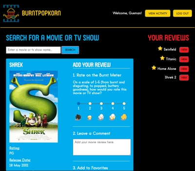
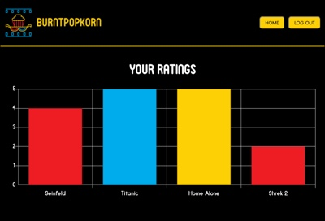

# BurntPopkorn

This project was bootstrapped with [Create React App](https://github.com/facebook/create-react-app).

## Table of Contents:

- [Description](#description)
- [User Story](#user-story)
- [Technologies Used](#technologies-used)
- [Link to Application](#link-to-application)
- [License](#license)
- [Screenshots](#screenshots)
- [Contributors](#contributors)

## Description

BurntPopkorn is a web-based application that allows users to search for movies and TV shows, see relevant information about them and also see the average rating for them based on other users' reviews. Users can rate the movies and TV shows, add comments about them and also add them to a list of favorites. Users can reference their reviews at a later date, update them and delete them. Users can also see graphs and charts related to their viewing and rating activity.

## User Story

As a connoisseur of movies and TV shows…

I want a way to rate movies and TV shows I have seen and leave comments about them for future reference.

I also want a way to keep track of my favorite movies and TV shows.

And I want a way to see my viewing activity over time.

## Technologies Used

- HTML
- CSS
- JavaScript
- Node.js
- Express
- mongoose
- MongoDB
- ReactJS
- React Chartjs
- Passport
- Axios
- Webtoken
- OMDb API
- Bcrypt
- Webpack
- React Likert Scale
- Heroku
- CanvasJs-React-Charts

## Link to Application

<https://burntpopkorn.herokuapp.com/>

## License

This application uses the MIT license.

<https://opensource.org/licenses/MIT>

## Screenshots:

Create Account Page  

Login Page  

Home Page  

Activity Page  

## Contributors:

Megan Carnaghi <https://github.com/MeganCarnaghi> 
Brian Smak <https://github.com/bjsmak> 
Daniel Hawthorne-Foss <https://github.com/dhfoss> 
Rodolfo Diaz <https://github.com/Rodolfod1>
